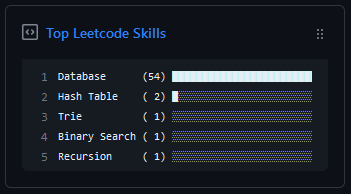

# Leetcode Skills Pinned Gist
<p align="center">
   
   <p align="center">Automatically update a pinned gist with your top leetcode skills.</p>
</p>

## Getting started
1. Create a new public gist with your title of choice (e.g 'Top Leetcode Skills') (https://gist.github.com/)
2. Create a token with the gist scope and make note of the API token (https://github.com/settings/tokens/new)
3. Fork this repo
4. Add new secrets in your fork's ```Settings``` > ```Secrets and variables``` > ```Actions```:
   - ```GH_TOKEN``` the API token generated in step 2
   - ```GIST_ID``` the ID part of the gist URL (after your username)
   - ```LEETCODE_USERNAME``` your leetcode username

### Ignoring difficulties/skills
If you want to exclude certain difficulties or individual skills you can do this by adding a secret called ```IGNORED_SKILLS``` and enter a list of skills/difficulties to ignore separated by commas.
